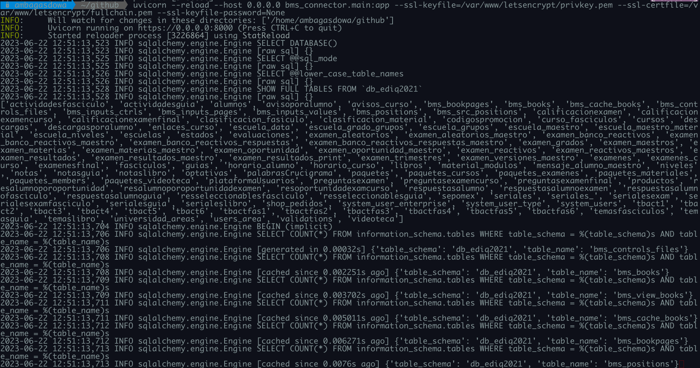

# Install the Api

- Instalar el schema de base de datos

```bash
  mysql --user=user --password=pass database < db/bms.sql
```

- Download the Api

```bash
  python3 -m pip install git+https://github.com/ambagasdowa/bms_connector.git@release

```

- Install the dependencies

```bash
  python3 -m pip install uvicorn fastapi sqlalchemy pandas pymysql jinja2 python-multipart
```

## Config setup

En el directorio raiz de la api se debe crear un archivo de configuracion

> config.py
> o reenombrar el archivo
> config_template.py
> la estructura es la siguiente:

```json

configuration = {
    "db_connection": {
        "server": "127.0.0.1",
        "driver": "pymsql+mysql",
        "database": "db_ediq2021",
        "user": "ediq",
        "password": 'db_ediq2021#',
        "proc_exec": "call",  # call[mariadb]|exec[mssql]...
                     "proc_0": "bms_proc_build_cache_inp_usr",


    },
    "download_config": {
        # Optional as global or by user authorization (Recomended)
        "token": "some_random_char36",
        "download_path": "/tmp/",
        "dir_path": "book/",
        "ext_basename": "https://baizabal.xyz/assets/Panamericano/files",
        "basename": "/var/www/image.uruk/public_html/Panamericano/files",
        "pathname": "/source",


    },

}

```

Normalmente los campos a editar son

### Parametros para conectar con la base de datos

- user
- database
- password

### Parametros para acceder a los libros

- ext_basename

  - Define la ruta externa/local donde estan publicadas las paginas de los libros[web_storage,webdav,https]
    

- basename

  - Define la ruta interna donde se alojaran los libros en formato zip que son cargados en el servidor

    

### Procedimientos almacenados(Stored Procedure) en Base de datos

> Los procedimientos deberan ejecutarse al crear un libro nuevo y al crear un
> usuario nuevo(servidor ediq productivo). La api ya contempla la ejecucion de los procedimeintos almacenados
> de manera interna pero al relacionar las tablas de la api con tablas externas como
> por ejemplo los usuarios de la app(ediq productivo), debe tomarse en cuenta que se necesita
> ejecutar los procedimientos(bms_proc_build_cache_inp_usr) de la api cuando se registre un usuario
> nuevo desde la plataforma ediq

# Servidor

Para iniciar el servidor de la api
fuera del directorio raiz de la applicacion
se usa el siguiente comando:

```bash
uvicorn --reload --host [host.ipv4] bms_connector.main:app --ssl-keyfile=privkey.pem --ssl-certfile=fullchain.pem --ssl-keyfile-password=[password|None]

```



> Si no se define un puerto de publicacion , por defecto publicacion de la api es en el puerto 8000


> El metodo books reemplaza al metodo items


## Ejemplos de como utilizar esta API

```bash
https --verbose --verify=no baizabal.xyz:8000/srcpositions/4/6 \
            [0]["bms_books_id"]=4 \
            [0]["bms_bookpages_id"]=6 \
            [0]["color"]="cyan" \
            [0]["lineWidth"]=2 \
            [0]["source_width"]="1440" \
            [0]["source_height"]="890" \
            [0]["inputType"]="radio" \
            [0]["page"]=3 \
            [0]["x1"]="120" \
            [0]["y1"]="80" \
            [0]["x2"]="230" \
            [0]["y2"]="40" \
            [1]["bms_books_id"]=4 \
            [1]["bms_bookpages_id"]=6 \
            [1]["color"]="cyan" \
            [1]["lineWidth"]=2 \
            [1]["source_width"]="1440" \
            [1]["source_height"]="890" \
            [1]["inputType"]="text" \
            [1]["page"]=3 \
            [1]["x1"]="120" \
            [1]["y1"]="80" \
            [1]["x2"]="230" \
            [1]["y2"]="40"
```

- query to

```bash
https --verify=no baizabal.xyz:8000/srcpos/4/6 | jq | cat -l json
```

- other

```bash
https --verify=no baizabal.xyz:8000/items/4/1702 | jq | cat -l json
```

- test

```bash
https --verify=no baizabal.xyz:8000/srcpositions/1 | jq | cat -l json
```

- files

```bash
https --verify=no -f POST baizabal.xyz:8000/upload \
      book_name="Matematicas Bachillerato de 2nd grado 002,Guia de estudio para ingreso a la unam 002,Guia de Estudio para la UV 002, Libro Fisica 2nd semestre de Bachillerato 002" \
      files@~/Development/book_matematicas_002_bachillerato.zip \
      files@~/Development/guia_unam_215_universidad.zip \
      files@~/Development/guia_uv_002_demo.zip \
      files@~/Development/book_fisica_002_bachillerato.zip \
      token:'ioafsyudfoansdfnjnkajsnd017341782yhodklasdhjnallaisdfu=='
```

# TODO

- Api [Server](https://github.com/ambagasdowa/bms_connector.git) Development

  - [~] Reorder Items method for release mysql work
  - [~] Add singleton to [items module] logic for serve [one] OR [many-to-many] responses
  - [ ] Add server or local parameter to img-paths[bookpages:{}] responses

> - [x] : done
> - [~] : Working on
> - [ ] : TODO

# Database source

> [database](https://gitlab.com/ambagasdowa/sql/-/raw/master/mariadb/panamericano/bms.sql)
